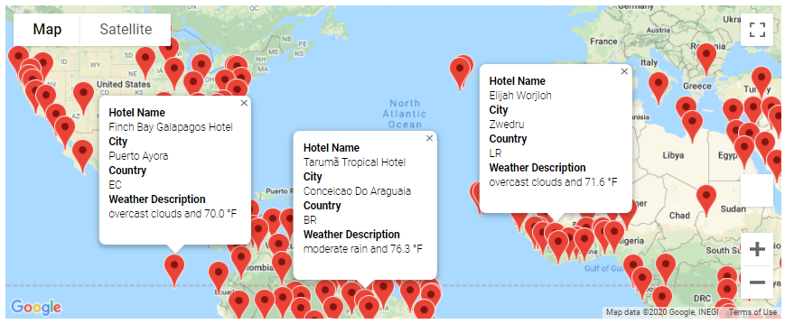

# World Weather Analysis

## Purpose

A coworker at PlanMyTrip requested help in collecting and analyzing weather data across over 500 cities worldwide to be used for recommending ideal hotels to their customers based on the clients' weather preferences.  Specifically, the coworker requested that the Google Maps and Places API and Search Nearby features be used to create a heat map that displays the following information about each city:

1. Name of a Hotel in the City
2. City Name
3. Country Code
4. Current Weather Condition 
5. Maximum Temperature

## Resources

 - Data source: schools_complete.csv & students_complete.csv
 - Software: Python 3.8, Anaconda Navigator (anaconda3), Jupyter Notebook (anaconda3)

## Results:

This analysis was completed in three major steps which are described below.

1. ) **Collecting the Data:**  
    The first step of the project was to collect the data.  To do this, the Numpy module was used to generate 2000 random numbers which were zipped together to create latitude and longitude pairs (in tuples) and saved as a list of coordinates as shown below.
    ```py
    # Import the dependencies
    import numpy as np
    
    # Create a set of random latitude and longitude combinations.
    lats = np.random.uniform(low = -90.000, high=90.000, size=2000)
    lngs = np.random.uniform(low=-180.000, high=180.000, size=2000)
    lat_lngs = zip(lats, lngs)
    lat_lngs
    
    #Add the latitudes and longitudes to a list.
    coordinates = list(lat_lngs)
    ```
    Next, the citipy module was used to find the nearest city to each latitude and longitude pair as shown in the following script.
    ```py
    # Import the dependencies
    from citipy import citipy
    
    # Create a list for holding the cities.
    cities = []

    #Identify the nearest city for each latitiude and longitude combination.
    for coordinate in coordinates:
        city = citipy.nearest_city(coordinate[0],coordinate[1]).city_name
        
        #If the city is unique, then we will add it to the cities list.
        if city not in cities:
            cities.append(city)
    ```
    To find the weather data for each city, the OpenWeatherMap API was used to request the current weather data from each unique city in the `cities` list as shown below.  The JSON data that was retreived from the API request was then parsed to the collect the latitude, longitude, country code, maximum temperature, humidity, cloudiness, wind speed, and current weather description.  The collected data was saved to a new DataFrame named `city_data_df.`
    ```py
    # Import the dependencies.
    import pandas as pd
    import requests

    # Import the API key.
    from config import weather_api_key
    
    # Starting URL for Weather Map API Call.
    url = "https://api.openweathermap.org/data/2.5/weather?units=Imperial&APPID=" + weather_api_key
    print(url)
    
    # Create an empty list ot hold the weather data.
    city_data = []
    
    # Loop through all the cities in our list.
    for i, city in enumerate(cities):
    
        # Create endpoint URL with each city.
        city_url = url + "&q=" + city.replace(" ", "+")
        
        # Run an API request for each of the cities.
        try:
            # Parse the JSON and retrieve data.
            city_weather = requests.get(city_url).json()
        
            # Parse out the needed data.
            city_lat = city_weather["coord"]["lat"]
            city_lng = city_weather["coord"]["lon"]
            city_max_temp = city_weather["main"]["temp_max"]
            city_humidity = city_weather["main"]["humidity"]
            city_clouds = city_weather["clouds"]["all"]
            city_wind = city_weather["wind"]["speed"]
            city_country = city_weather["sys"]["country"]
            city_current = city_weather["weather"][0]["description"]
        
            # Append the city information into city_data list.
            city_data.append({"City": city.title(),
                          "Country": city_country,
                          "Lat": city_lat,
                          "Lng": city_lng,
                          "Max Temp": city_max_temp,
                          "Humidity": city_humidity,
                          "Cloudiness": city_clouds,
                          "Wind Speed": city_wind,
                          "Current Description": city_current})
        
        # If an error is experienced, skip the city.
        except:
            print("City not found. Skipping...")
            pass
                      
    # Convert the array of dictionaries to a Pandas DataFrame.
    city_data_df = pd.DataFrame(city_data)
    ```

2. ) **Creating the Customer Travel Destinations Map:**
    The second step of the project was to create a map that shows the clients all of the possible travel destinations within their specified weather preferences, from the `city_data_df` DataFrame generated in the first step and to also display a hotel in each city on the map.  To do this, the client first needs to be able to select their weather preferences.  This was accomplished by creating two input boxes which ask the client what minimum and maximum temperatures they would like for their trip.  See the script below.
    ```py
    # Prompt the user to enter minimum and maximum temperature criteria 
    min_temp = float(input("What is the minimum temperature you would like for your trip? "))
    max_temp = float(input("What is the maximum temperature you would like for your trip? "))
    ```
    The `city_data_df` DataFrame was then filtered using the input temperatures from the client.  Using the data from the filtered DataFrame, a new DataFrame (`hotel_df`) was created to contain only the data necessary for the map, along with a new column called "Hotel Name".
    ```py
    # Filter the city_data_df DataFrame using the input statements to create a new DataFrame using the loc method.
    preferred_cities_df = city_data_df.loc[(city_data_df["Max Temp"] <= max_temp) & (city_data_df["Max Temp"] >= min_temp)]
    
    # Create DataFrame called hotel_df to store hotel names along with city, country, max temp, and coordinates.
    hotel_df = preferred_cities_df[["City", "Country", "Max Temp", "Current Description", "Lat", "Lng"]].copy()

    # Create a new column "Hotel Name"
    hotel_df["Hotel Name"] = ""
    ```
    To find a hotel in each of the filtered cities, the Google Directions API was used to search for hotels within 5000 meters of the latitude and longitude coordinates of each city.  The JSON data that was retreived from the API request was then parced to collect the first hotel name from the results as shown below.
    ```python
    # Import API key
    from config import g_key

    # Set parameters to search for hotels with 5000 meters.
    params = {
    "radius": 5000,
    "type": "lodging",
    "key": g_key}

    # Iterate through the hotel DataFrame.
    for index, row in hotel_df.iterrows():

        # Get latitude and longitude from DataFrame
        lat = row['Lat']
        lng = row['Lng']
    
        params['location'] = f'{lat},{lng}'
    
        # Set up the base URL for the Google Directions API to get JSON data.
        base_url = "https://maps.googleapis.com/maps/api/place/nearbysearch/json"

        # Make request and retrieve the JSON data from the search. 
        hotels = requests.get(base_url, params=params).json()
    
        # Get the first hotel from the results and store the name, if a hotel isn't found skip the city.
        try:
            hotel_df.loc[index, 'Hotel Name'] = hotels['results'][0]['name']
        except (IndexError):
            print('Hotel not found...skipping.')
    ```
    After removing any rows with no hotel names from the `hotel_df` DataFrame and saving it as `clean_hotel_df`, a map was generated using `gmaps.configure()` to show the client each of the possible travel destinations within their weather preferences.  Within the map, an info box was created to allow the client to click on a destination marker to display a popup box which includes the name of a hotel near the city, the name of the city, the country code, the current weather description and the maximum temperature. See the script below.
    ```py
    # Configure gmaps API key
    gmaps.configure(api_key=g_key)
    
    Using the template add city name, the country code, the weather description and maximum temperature for the city.
    info_box_template = """
    <dl>
    <dt>Hotel Name</dt><dd>{Hotel Name}</dd>
    <dt>City</dt><dd>{City}</dd>
    <dt>Country</dt><dd>{Country}</dd>
    <dt>Weather Description</dt><dd>{Current Description} and {Max Temp} °F</dd>
    </dl>
    """

    # Get the data from each row and add it to the formatting template and store the data in a list.
    hotel_info = [info_box_template.format(**row) for index, row in clean_hotel_df.iterrows()]

    # Get the latitude and longitude from each row and store in a new DataFrame.
    locations = clean_hotel_df[["Lat", "Lng"]]
    
    # Add a marker layer for each city to the map. 
    fig = gmaps.figure(center=(30.0, 31.0), zoom_level=1.5)
    marker_layer = gmaps.marker_layer(locations, info_box_content=hotel_info)
    fig.add_layer(marker_layer)

    # Display the figure
    fig
    ```
    
   
3. ) Visualize Travel Data:
Create a heatmap with pop-up markers that can display information on specific cities based on a customer's travel preferences. Complete these steps:
 - Filter the Pandas DataFrame based on user inputs for a minimum and maximum temperature.
 - Create a heatmap for the new DataFrame.
 - Find a hotel from the cities' coordinates using Google's Maps and Places API, and Search Nearby feature.
 - Store the name of the first hotel in the DataFrame.
 - Add pop-up markers to the heatmap that display information about the city, current maximum temperature, and a hotel in the city.
 
 ## Summary
Create scatter plots of the weather data for the following comparisons:
 - Latitude versus temperature
 - Latitude versus humidity
 - Latitude versus cloudiness
 - Latitude versus wind speed
Determine the correlations for the following weather data:
 - Latitude and temperature
 - Latitude and humidity
 - Latitude and cloudiness
 - Latitude and wind speed
Create a series of heatmaps using the Google Maps and Places API that showcases the following:
 - Latitude and temperature
 - Latitude and humidity
 - Latitude and cloudiness
 - Latitude and wind speed
